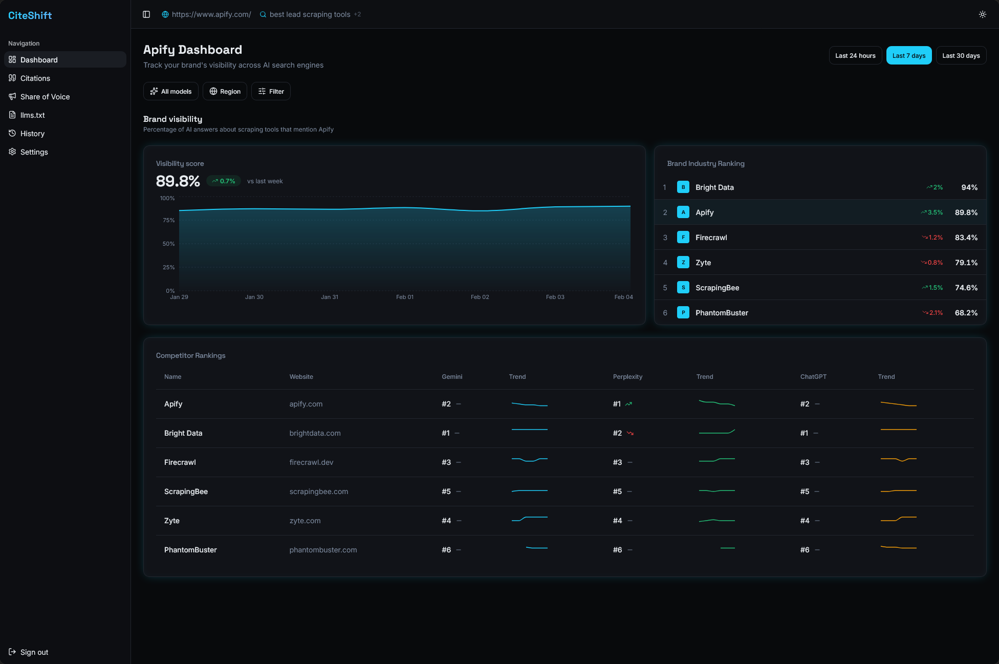
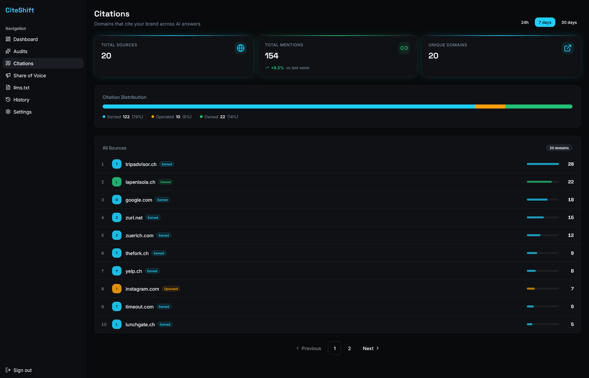
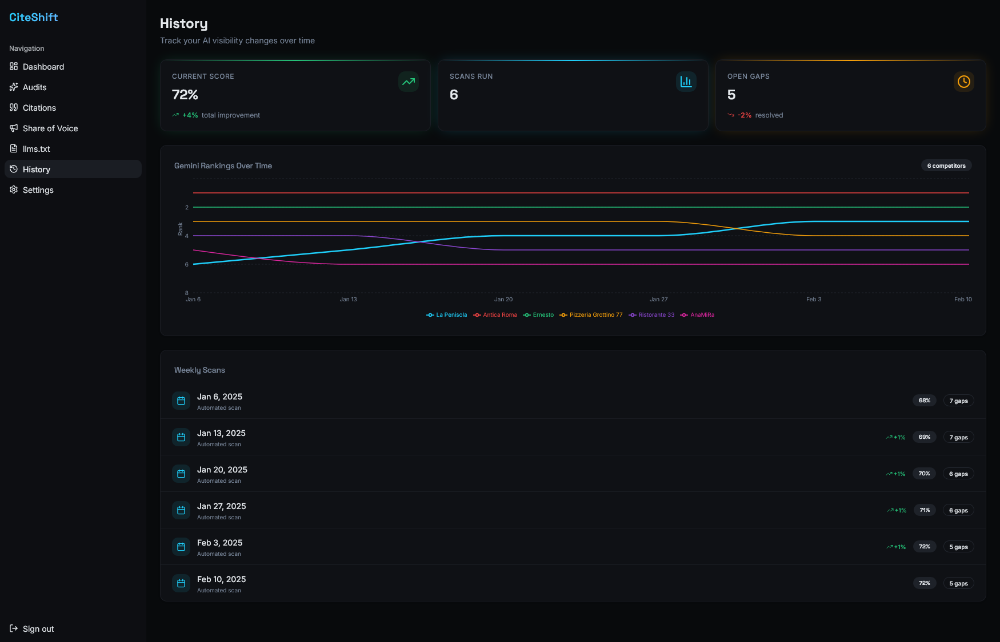
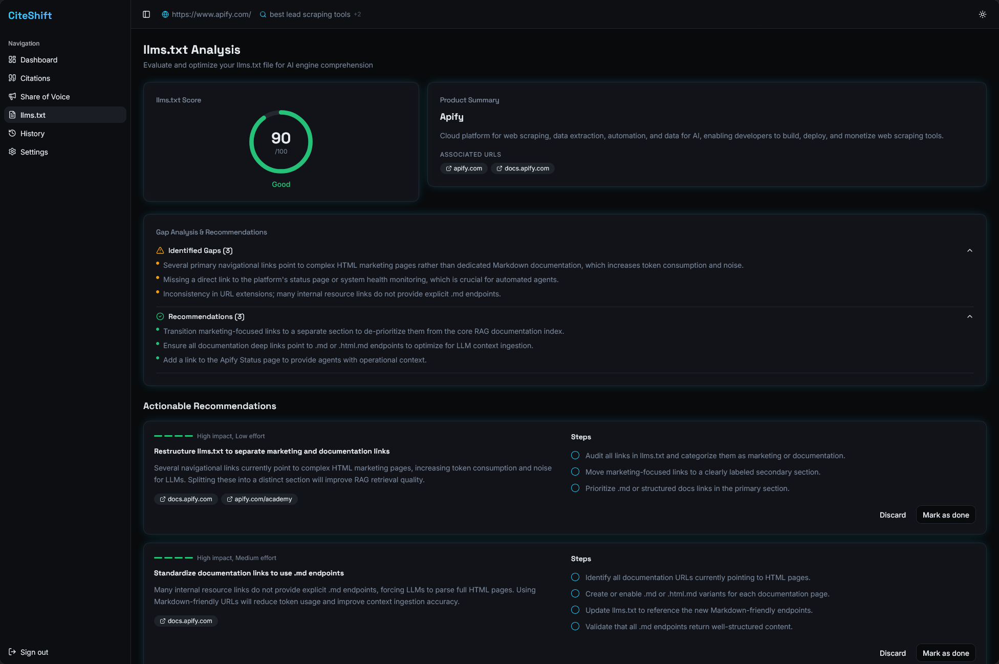
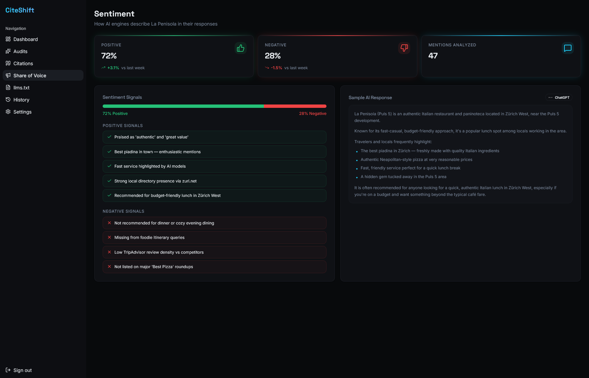

# CiteShift: Visibility Intelligence for the AI Search Era

Submission for the [GenAI Zurich 2026 Hackathon](https://genaizurich.devpost.com/) - Apify Challenge.

## The Problem: Your Business Is Becoming Invisible

For twenty years, digital visibility meant one thing: ranking in the top ten blue links of search engines. We built an entire industry (Search Engine Optimization, aka SEO) around tracking, measuring, and optimizing for these clicks. 

That era is over. 

Today, users aren't clicking links; they are asking ChatGPT, Perplexity, and Google AI Overviews. The shift from search engines to AI answers is happening at breakneck speed, but the tooling hasn't caught up. Businesses are suddenly flying blind. Traditional rankings are no longer transparent, traffic is dropping, and even companies with phenomenal products are losing their visibility because they don't know how to track or optimize for LLM-driven answers.

This shift is already measurable:

* In 2024, **58.5% of U.S. Google searches** and **59.7% of EU Google searches** ended without a click. Source: [SparkToro + Datos (2024)](https://sparktoro.com/blog/2024-zero-click-search-study-for-every-1000-us-google-searches-only-374-clicks-go-to-the-open-web-in-the-eu-its-360/).
* For every 1,000 Google searches, only **360 clicks (U.S.)** and **374 clicks (EU)** reached the open web. Source: [SparkToro + Datos (2024)](https://sparktoro.com/blog/2024-zero-click-search-study-for-every-1000-us-google-searches-only-374-clicks-go-to-the-open-web-in-the-eu-its-360/).
* In Google's own launch update, AI Overviews had already been used **billions of times** in Search Labs and were expected to reach **over 1 billion users** by the end of 2024. Source: [Google Search announcement (May 2024)](https://blog.google/products/search/generative-ai-google-search-may-2024/).

I built CiteShift because I have 6+ years of experience as a full-stack web developer and SEO analyst, helping clients improve their web presence. I have seen this transition firsthand: even well-executed SEO programs are losing visibility when brands are not represented in AI-generated answers.

If your company isn't mentioned when a user asks an AI, you no longer exist in their buying journey. 

## The Solution: A New Category of Intelligence

CiteShift helps companies understand, measure, and improve how they appear in AI-generated answers. Instead of tracking outdated keyword positions, CiteShift introduces the Visibility Score: a unified, cross-engine metric that measures exactly how prominently your brand appears across the AI ecosystem. 



It provides competitive intelligence, source-level tracking, and actionable recommendations to help you engineer your presence in the LLMs of tomorrow.

### Product Walkthrough

The **Citations** view breaks down exactly which domains are cited in AI answers and classifies them as Owned, Operated, or Earned sources, so teams can understand where authority is really coming from.



The **History** view turns weekly scans into a longitudinal record of ranking movement and score shifts, helping teams measure the impact of content and GEO changes.



The **llms.txt Analysis** view evaluates LLM-readiness directly, highlights context gaps, and generates prioritized recommendations to improve machine-readable brand context.



The **Share of Voice** view compares your visibility with direct competitors and shows trend lines over time, making it easy to spot who is gaining AI mindshare in your category.



### How It Works

1. **Input:** You enter your company URL and optionally a list of search queries.
2. **Industry & Product Discovery:** CiteShift inspects your `llms.txt` first (if available) and falls back to crawling your website to infer your product category and market context.
3. **Query Selection:** If input queries are provided, CiteShift uses them directly. Otherwise, Gemini generates high-value industry queries automatically from the discovered context.
4. **Data Collection:** CiteShift collects AI-generated answers from search-integrated LLM systems via Apify Actors (Google AI mode, Perplexity, and ChatGPT-integrated search).
5. **AI Analysis:** Gemini extracts competitors, evaluates ranking positions per query, and cross-references mentions across all engines.
6. **Scoring:** CiteShift calculates the Visibility Score for you and your competitors.
7. **Source & llms.txt Analysis:** The system maps the exact URLs driving the AI answers and checks your domain’s `/llms.txt` file for LLM-readiness.
8. **Insights Delivery:** A structured report and visual dashboard present the intelligence, showing exactly where you are losing out and how to fix it.

### Technical Architecture

CiteShift requires a robust pipeline capable of bridging unstructured web data with precise, structured reasoning. 

* **Data Collection Layer (Apify):** We use Apify Actors (`apify/google-search-scraper` and `apify/website-content-crawler`) for collecting AI-generated answers from search-integrated LLM systems. This captures the full answer text, cited sources, and query context.
* **Intelligence Layer:** We leverage Gemini 3.1 Flash Lite as our core reasoning engine. It ingests the raw AI outputs, performs competitor identification, ranks them per query/engine, and aggregates cross-query intelligence.
* **Domain Normalization & Source Classification:** The system extracts, deduplicates, and resolves cited URLs, classifying them into Owned (your site), Operated (your social/app profiles), and Earned (third-party articles).
* **Visibility Score Logic:** A custom algorithm that weights frequency of mentions, ranking positions in the generated text, and presence across multiple queries to compute the final score.

### Real-World Validation: The Apify Case Study

To validate the platform in a real environment, we ran a case study on Apify using its own domain and high-value industry queries. The results were clear: a key competitor was repeatedly ranked above Apify in AI-generated answers.

The Source Intelligence layer explained why. LLMs were frequently citing Apify's own blog content, but that same content was being interpreted in ways that supported competitor recommendations.

This exposed a critical visibility vulnerability and triggered a direct discussion with Apify's marketing team about how their content is being read and reused by AI systems. The same pattern can affect any company whose content is being consumed by LLMs but not strategically shaped for AI-era discovery.

## What Makes CiteShift Unique

* **The Visibility Score:** We are replacing traditional keyword rankings with the first unified metric designed explicitly for AI-era visibility.
* **Multi-LLM Analysis:** We don't just look at one engine. We aggregate ChatGPT, Perplexity, and Google AI.
* **Source-Level Intelligence:** We don't just tell you if you were mentioned; we track why. We identify the exact Owned, Operated, and Earned URLs driving the LLM's output.
* **Automated llms.txt Evaluation:** CiteShift automatically fetches your `/llms.txt` file. Gemini summarizes the content, scores it (0–100), identifies critical context gaps, and gives recommendations. If you don't have one, CiteShift flags it as a high-priority technical GEO vulnerability.
* **Actionable Insights:** We don't just output data; we output strategy. 

## Challenges & Learnings

Building a deterministic metric out of probabilistic outputs is incredibly difficult. 

* **Extracting Structured Data:** Normalizing inconsistent, conversational outputs from various LLM architectures into a strict, analyzable schema.
* **Source Attribution:** LLMs cite sources in drastically different ways (inline brackets, footnotes, raw links). Standardizing this data required intensive tuning.
* **Designing the Visibility Score:** Figuring out how to weight a "mention" in a ChatGPT answer versus a primary citation in Perplexity took significant iteration to make the metric actually meaningful.

## Future Vision

CiteShift is just getting started. This hackathon project is the MVP of what could become a full-scale B2B SaaS platform.

Our roadmap includes:

* **Continuous Monitoring:** Tracking AI visibility over time.
* **Automated Alerts:** Slack/Email notifications when your Visibility Score drops or a competitor overtakes you in a high-value query.
* **GEO Tooling:** Real-time recommendations for tweaking landing page copy specifically for LLM ingestion.
* **Full SaaS Dashboard:** A fully interactive web application for marketing teams to track their Generative Engine Optimization.

### Built With

* **Apify** (Actors for complex web/search data extraction)
* **Gemini 3.1 Flash Lite** (High-speed, cost-effective reasoning engine)
* **LLM-based structured analysis pipelines**
* **Python** (Backend orchestration and data transformation)
* **Lovable (React)** (Dashboard visualization)

## Acknowledgements

This project would not have been possible without the support, feedback, and insights from GenAI Zurich mentors and the Apify team.

- Benjamin Fuchs (AI Automation Specialist)
- Dušan Vystrčil (AI Product Manager @ Apify)
- Aleš Wilk and Kateryna Shvets (Marketing @ Apify)
- Pascal Vetter (AI Ecosystem Enabler @ AI Startup Center Zürich)

## Get Started

Run CiteShift locally in a few steps.

### 1. Install dependencies

```bash
python -m venv .venv
source .venv/bin/activate
pip install -r requirements.txt
```

### 2. Configure environment variables

Copy the example file and fill in your API credentials:

```bash
cp .env.example .env
```

Then edit `.env` and set your values:

```env
APIFY_TOKEN=your_apify_token
GEMINI_API_KEY=your_gemini_api_key
USE_CACHE=false
```

### 3. Change the actor input

Edit [input.json](input.json) with your own target domain. Optionally include `search_queries` to override auto-generation:

```json
{
  "url": "https://your-domain.com/",
  "search_queries": [
    "best tools in your category",
    "top alternatives for your product type"
  ]
}
```

### 4. Run the actor locally

```bash
apify run --input-file input.json
```

### 5. Review output

After a run, the actor writes the final analysis to [report.json](report.json).

This repository already includes a test report at [report.json](report.json), generated from sample URL input in [input.json](input.json), so you can review the expected output structure immediately.
